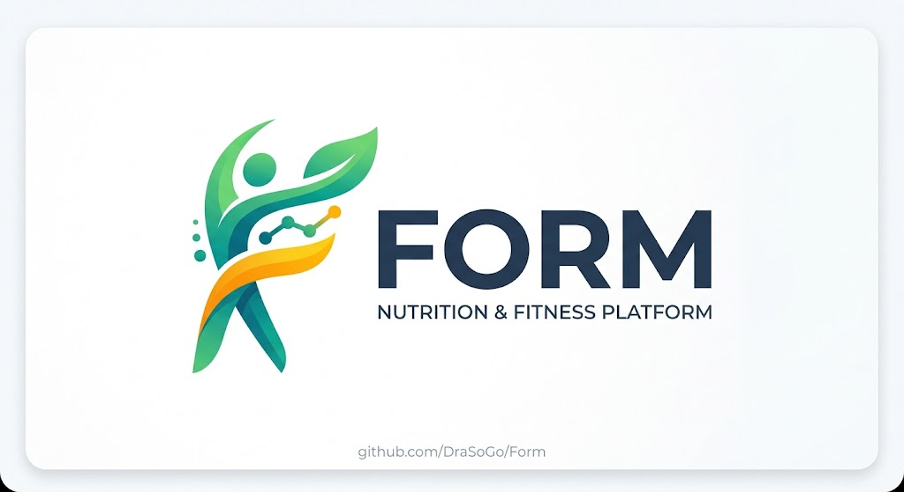
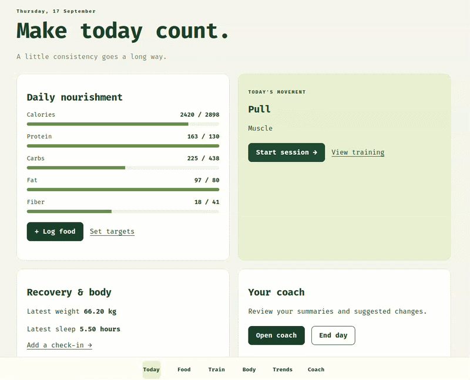
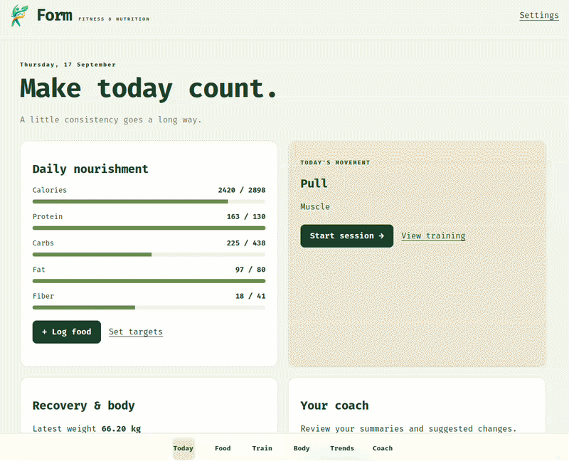
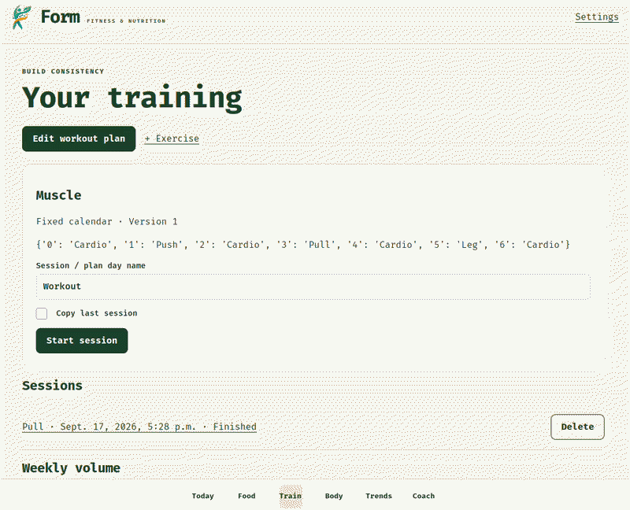
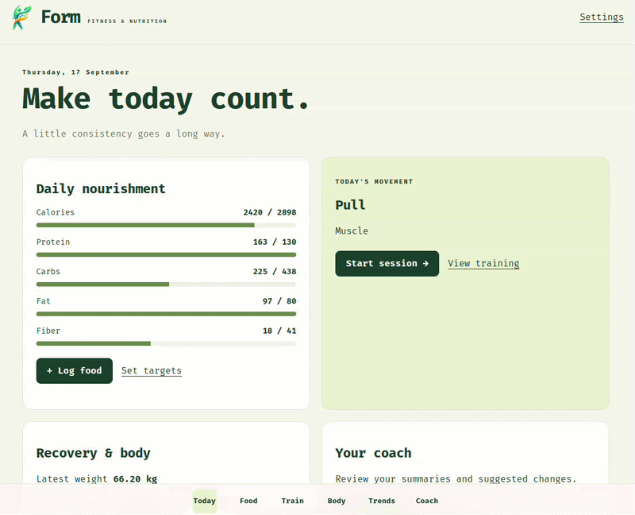
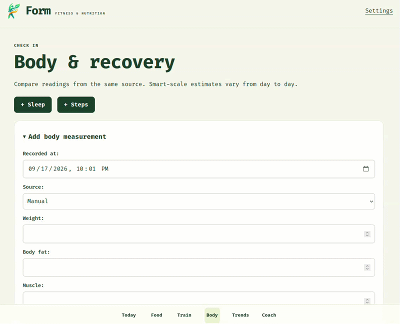
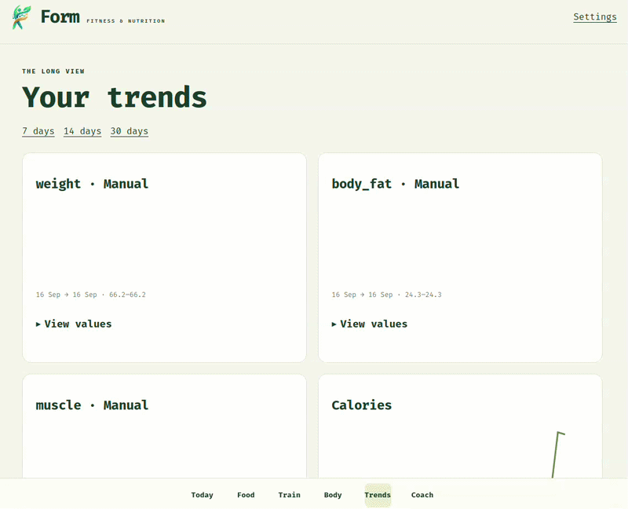
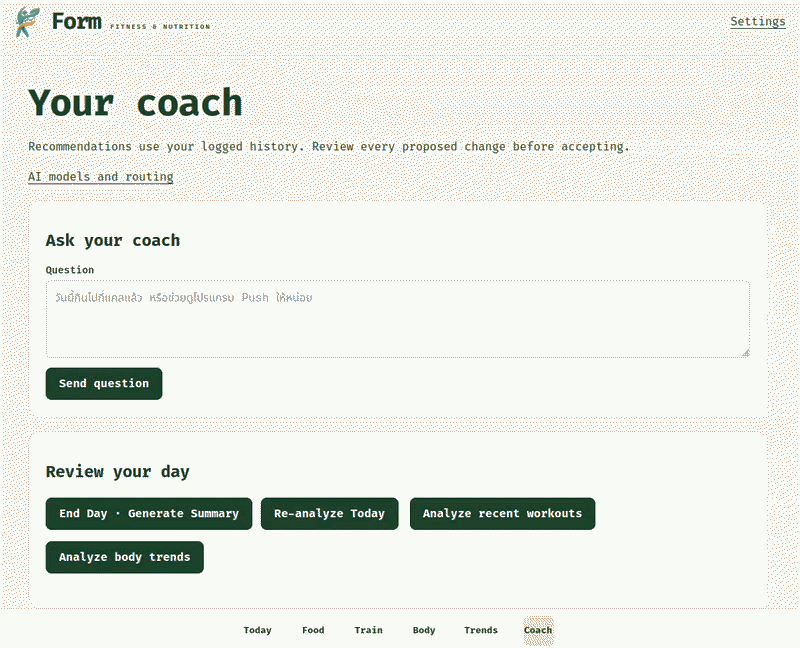
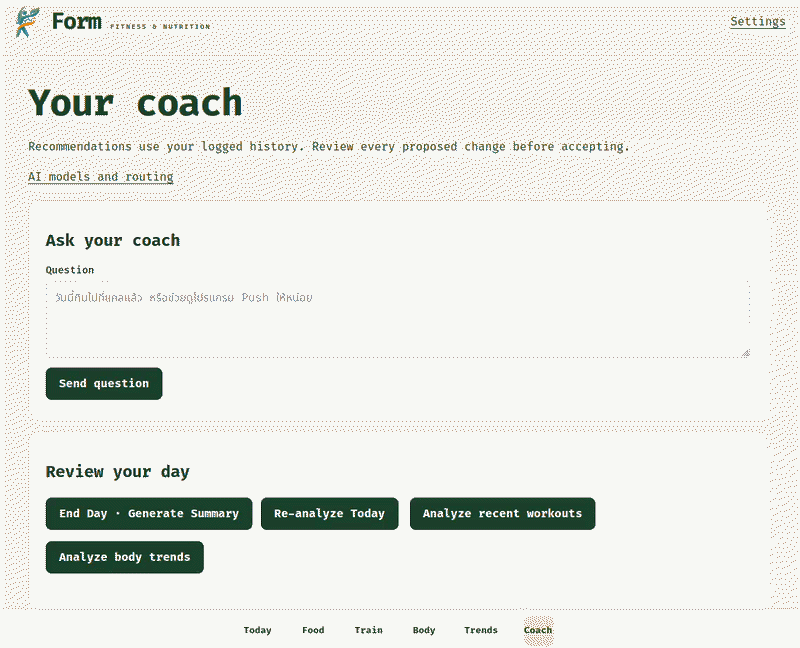

<p align="center">
  
</p>

<p align="center">A private fitness, nutrition, and AI coaching app built for one person.</p>

Form combines meal tracking, workout logging, body measurements, recovery data, trends, and AI-assisted reviews in one mobile-friendly Django application. You keep the source, database, photographs, and deployment under your control.

## Contents

- [Features](#features)
- [Quick start](#quick-start)
- [Configuration](#configuration)
- [Using the app](#using-the-app)
- [AI and privacy](#ai-and-privacy)
- [Backup and recovery](#backup-and-recovery)
- [Testing](#testing)
- [Documentation](#documentation)

## Features

### 1. Today dashboard

The dashboard shows today's nutrition progress, the next scheduled session, recent recovery readings, and shortcuts to the coach and food diary.

- Daily calories and macronutrient progress
- Next workout based on the active plan
- Latest weight and sleep values
- Recent meals and end-of-day analysis

<p align="center">
  
</p>

### 2. Food diary and photo analysis

Log a meal manually or choose a photograph from the camera, photo library, or device files. The configured vision model can estimate the meal, but you review and edit every value before relying on it.

- Calories, protein, carbohydrates, fat, fiber, sugar, and sodium
- Private authenticated food photographs
- AI photo analysis with editable estimates
- Saved foods and reusable meal templates
- Daily totals and nutrition targets

<p align="center">
  
</p>

### 3. Training plans and exercise library

Build fixed-calendar or rotating workout plans from your own exercise library. Exercises support strength or cardio, equipment selection, optional muscle metadata, and archival without deleting workout history.

- Strength and cardio activities
- Fixed weekly schedules or rotating routines
- Equipment sourced from Settings
- Plan version history
- Exercise archive and AI-assisted metadata

<p align="center">
  
</p>

### 4. Live workout session

Run a session from your phone, record actual performance, and keep the previous session visible for reference.

- Sets, repetitions, load, RIR, RPE, and notes
- Cardio duration and completion state
- Rest timers for 60, 90, and 120 seconds
- Copy values from the previous session
- Complete, edit, or delete individual entries

<p align="center">
  
</p>

### 5. Body and recovery

Record body composition, sleep, and daily steps without overwriting historical measurements. Source labels keep manual, smart-scale, and calculated readings distinguishable.

- Weight, body fat, muscle, visceral fat, body age, BMR, and BMI
- Measurement source and timestamp
- Sleep history
- Daily step count
- Edit and delete controls for owned records

<p align="center">
  
</p>

### 6. Trends

Review changes across 7, 14, or 30 days. Training tables show weekly volume and recent exercise performance alongside body and nutrition charts.

- Body and nutrition charts
- Weekly direct and indirect training volume
- Best load and recent set performance
- Same-source body measurement comparisons

<p align="center">
  
</p>

### 7. AI coach

Ask questions, analyze recent workouts or body trends, and generate a daily summary. Model output is stored as a reviewable result. Proposed target or plan changes require an explicit accept action.

- Coach chat with bounded personal context
- Food, workout, body, and daily-summary tasks
- Thai responses from configured coaching prompts
- Provider fallback and manual retry
- Accept or reject versioned suggestions

<p align="center">
  
</p>

### 8. Settings, equipment, and data tools

Settings holds the profile values used for target calculations and the equipment list used by the exercise form. It also links to password, AI, push notification, export, and import controls.

- Age, sex, height, goal, activity level, timezone, and summary time
- Equipment inventory
- Nutrition targets
- JSON archive and CSV exports
- Validated archive import
- Photo retention and password controls

<p align="center">
  
</p>

## Quick start

### Requirements

- Docker Engine with Docker Compose
- A Linux host or VM
- A domain or private-network address for browser access
- PostgreSQL storage and a writable media directory, both created by the supplied deployment layout

### Prepare the deployment

```sh
sudo install -d -m 755 /srv/docker/apps/fitness
cd /srv/docker/apps/fitness
sudo install -d -m 700 secrets
sudo install -d -o 1000 -g 1000 -m 700 data/media
sudo cp .env.example secrets/runtime.env
sudo chmod 600 secrets/runtime.env
```

Edit `secrets/runtime.env` and set fresh values for `SECRET_KEY`, `POSTGRES_PASSWORD`, `ALLOWED_HOSTS`, and `CSRF_TRUSTED_ORIGINS`. Add AI and push credentials only when you want those features.

### Start the services

```sh
sudo docker compose build
sudo docker compose up -d db
sudo docker compose run --rm web python manage.py migrate --noinput
sudo docker compose run --rm web python manage.py createsuperuser
sudo docker compose up -d web worker
sudo docker compose ps
```

Open `http://<SERVER_IP>:8095` on a trusted LAN. For access outside that network, place the app behind an authenticated HTTPS reverse proxy and update the allowed host and trusted origin values.

## Configuration

Copy `.env.example` to the protected runtime file and replace every placeholder. The application reads secrets from the server environment; it does not expose provider keys to the browser.

| Area | Main variables |
|---|---|
| Django | `SECRET_KEY`, `ALLOWED_HOSTS`, `CSRF_TRUSTED_ORIGINS`, `TIME_ZONE` |
| Database | `POSTGRES_DB`, `POSTGRES_USER`, `POSTGRES_PASSWORD` |
| AI pools | `AI_CLAUDE_*`, `AI_GPT_*`, `AI_CHINA_*` |
| Push | `VAPID_PUBLIC_KEY`, `VAPID_PRIVATE_KEY`, `VAPID_SUBJECT` |
| Backup validation | `BACKUP_CIFS_SOURCE` |

See [Deployment](docs/deployment.md) for the production layout and [AI routing](docs/ai-routing.md) for model discovery, testing, and task routing.

## Using the app

1. Complete **Settings** with your age, sex, height, goal, activity level, timezone, and available equipment.
2. Create nutrition targets and a workout plan.
3. Add exercises as strength or cardio activities.
4. Log meals, body readings, sleep, steps, and workout sessions.
5. Configure verified AI models under **Coach → AI models and routing**.
6. Review every AI estimate or suggested change before accepting it.

The site includes a web app manifest and service worker. Use your mobile browser's **Add to Home Screen** action to install it as a PWA.

## AI and privacy

Manual tracking works without an AI provider. When you request analysis, the app sends a bounded set of relevant records to the configured provider. Food analysis sends a resized copy of the selected image. Provider credentials stay on the server.

AI output can contain mistakes. Food values remain editable, and coaching suggestions cannot change the active nutrition target or workout plan until you accept them. Read [Security and privacy](docs/security.md) and [AI routing](docs/ai-routing.md) before connecting a provider.

## Backup and recovery

The backup tool creates PostgreSQL dumps and content-addressed media snapshots under the configured NAS mount. It verifies checksums, retains daily and weekly recovery points, and can restore into an isolated test database without overwriting production.

```sh
sudo python3 ops/backup.py backup
sudo python3 ops/backup.py verify
sudo python3 ops/backup.py restore-test
```

Set `BACKUP_CIFS_SOURCE` when you want the job to require one exact CIFS source. Read [Backup and restore](docs/backup-restore.md) before enabling timers or recovering data.

## Testing

```sh
SECRET_KEY=test-only USE_SQLITE=1 SECURE_COOKIES=false \
  .venv/bin/python manage.py test

.venv/bin/python -m unittest discover -s ops -p 'test_*.py' -v
```

Tests use isolated data and mocked provider responses. Live AI checks, browser notification permission, and native PWA installation require explicit manual verification.

## Documentation

| Document | Use it for |
|---|---|
| [Documentation index](docs/README.md) | Choose the right guide |
| [Requirements](docs/requirements.md) | Product scope and acceptance criteria |
| [Architecture](docs/architecture.md) | Components, boundaries, and data flow |
| [Deployment](docs/deployment.md) | First installation, updates, rollback, and monitoring |
| [AI routing](docs/ai-routing.md) | Provider configuration and model verification |
| [Backup and restore](docs/backup-restore.md) | NAS snapshots and disaster recovery |
| [Security and privacy](docs/security.md) | Authentication, secrets, photos, and exposure controls |
| [Verification record](docs/verification.md) | Tested behavior and remaining physical-device checks |

## Project boundaries

Form is a single-user record-keeping and coaching tool. It does not provide public registration, medical diagnosis, or offline data synchronization. Smart-scale readings and image-based nutrition estimates are approximate; use consistent measurement sources and review estimates before using them.
